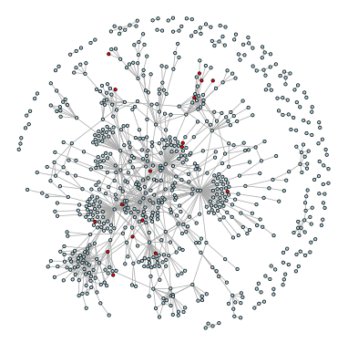
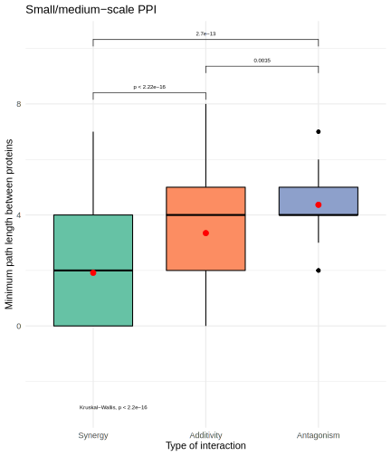
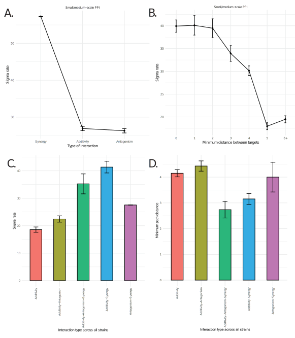

# Introduction

  Biological networks are representations of molecular interactions in the cell. These networks are constructed by collecting biochemical and genetic interactions from different kinds of biological entities, an approach that has improved drastically in the last decades with the advent of modern high-throughput methods. However, there are still many limitations for the gathering and analysis of biological networks, specifically for modelling network evolution across and within species. This is because many biological networks have poor quality or are incomplete, and because the number of organisms for which network data is available is still very limited [@Jin2013; @Cusick2005; @Ghadie2018]. Despite these limitations, many advances have been made in characterizing static networks, and in developing a theoretical framework for studying their evolution across species. 
  
  Biological networks evolve as nodes and edges are added or lost in the network. This can be the result of different processes affecting network content, such as gene duplication, gene loss, pseudogenization, HGT or WGD [@Wagner2003; @Cork2004], or a result of processes affecting quantitative properties, including  non-synonymous substitutions in the nodes affecting their function (e.g. mutations affecting the binding of ligands, protein domains or DNA motifs may result in changes in metabolic processes, signaling pathways or gene expression regulation, among others) [@Jensen1976; @Ghadie2018]. These evolutionary events remove old connections and generate new ones, in a process that may be random. However, we also know that not all motifs are equally abundant in biological networks [@Picard2008]. This may be the result of natural selection removing deleterious connections and favoring advantageous ones. In addition to this, rewiring rates vary depending on several factors. For example, the type of network may have an effect in rewiring rates, since some networks networks such as gene regulatory networks tend to rewire at faster rates than more constrained networks such as metabolic networks [@Shou2011]. 
  
  Rewiring rates also vary within networks, such as between different network modules and between nodes depending on their importance for the cell's survival and reproduction, and the essentiality of a node or module  may be a constraining factor for network evolution. Previous studies have shown an inverse relationship between highly connected proteins and their rate of substitution [@Fraser2002], possibly due to strong purifying selection acting on the interfacial sites of interacting proteins [@Zotenko2008]. 
  
  Despite these advances at studying the connections of individual nodes and global network rewiring rates, the rate at which quantitative differences between networks accumulate as a function of species divergence remains relatively unexplored. In particular, it is unknown whether evolutionary rates of inter-node connectivity are correlated with inter-node network measures, such as the minimum path length or average node degree between nodes. 
  
  In this paper, we use drug-drug interactions (DDIs as a quantitative proxy measurement of inter-node connectivity, since it has been shown that DDIs are partially dependent on the underlying network topology between targets [@Lehar2007; @Yeh2009]. Drug-drug interactions (DDIs) occur when the effect of two or more drugs is significantly stronger or weaker than their expected combined effect, respectively named synergies and antagonisms [@Cowen2008]. DDIs are used in the development of novel pharmacological treatments with higher efficiencies at lower doses with the aim of reducing the evolution of drug resistance [@Cowen2008]. The reasons why a DDI occurs are varied, but it has been shown that a DDI can occur as a result of factors such as (1) the topology of the underlying network between drug targets, (2) the essentiality of the metabolites blocked by the perturbation, and the inhibition efficiency of the drug on the drug target [@Yeh2009]. For example, synergies can occur if drugs act on parallel pathways, where the individual effect of each drug is small and an alternative pathway can compensate for the effect of a single drug [@Yeh2009]. Alternatively, antagonistic interactions can occur mainly in two different ways: by causing a partial loss of function in two parallel pathways of an essential product, or as a result of drugs acting sequentially along the same pathway [@Yeh2009]. This relation between DDIs and network topology has been further explored using experiments and metabolic flux simulations in yeast, suggesting that specific combinations of perturbations in the network result in different quantifiable interaction scores [@Lehar2007]. More recently, it has been shown that most synergistic interactions are the result of drugs targeting the same cellular process, while antagonistic interactions are the result of drugs targeting different processes [@Brochado2018]. 
  
  Only a few studies have explored interspecific variation of DDIs [@Spitzer2011; @Robbins2015; @Brochado2018], but they have shown that DDI scores could be scalable to include higher numbers of species and strains, allowing for the evaluation of network evolution hypotheses within and between species. A high throughput study of DDIs in gram-negative bacteria has shown that antagonistic interactions are more common, and are almost exclusively detected on drugs that target different cellular processes, while synergies are more conserved across species, and they are more frequent in drugs that target the same process [@Brochado2018]. In that study, 70% of the DDIs detected were species-specific, while 20% were strain-specific. 
  
  Given these previous findings, we had two related questions. First, do DDI scores diverge as a function of species divergence, consistent with neutral processes acting on the underlying network structure? Or is there substantial constraint on some DDI scores, consistent with evolutionary constraint on the drug targets, their connectivity, and the drugs’ mode of action?
  
  Second, do synergistic interactions evolve at a slower rate than other types of drug interactions, and antagonistic interactions evolve at a faster rate? These differences in rates would be a result of synergistic interactions taking place in local neighborhoods of nodes, while antagonistic interactions act on distant network neighborhoods, which appear to evolve more slowly because of greater network redundancy between distant nodes. Indeed, if we were to map DDIs to protein targets (when known), are the drug targets of synergistic drug interactions closer in the network than additive and antagonistic interactions? And, more generally, are more closely connected nodes subject to higher rates of evolution than more distantly related nodes?
  
  To address these questions, we used the most complete available dataset of species specific and strain specific DDIs [@Brochado2018]. We modelled these DDIs under a phylogenetic comparative framework and applied a multivariate brownian motion model to estimate the evolutionary rate of interaction scores for different clusters of DDIs in six strains (three species) of gram-negative bacteria. We also mapped DDIs to their putative protein targets to evaluate them in known biological networks. We show that DDIs can be used as an effective proxy  to evaluate macroevolutionary implications and the role of network evolution in interspecific variation.  

# Methods

We obtained DDI scores from a previous study [@Brochado2018] that assessed almost 3000 combinations of 79 different compounds on six strains of three species of gram-negative bacteria (pae: *P. aeruginosa PAO1*, pau: *P. aeruginosa UCBPP-PA14*, stm: *S. enterica subsp. enterica serovar Typhimurium LT2*, seo: *S. enterica subsp. enterica serovar Typhimurium 14028S*, ecr: *E. coli O8 IAI1 (commensal)*, ebw: *E. coli K-12 BW2952)*. In particular, we used their following datasets, tables ED09C for modelling DDI evolution, and Sup. Tables 1 and 2 to compare different categories of drugs. We constructed phylogenetic trees of the six strains using PhySpeTree to obtain estimate branch lengths [@Fang2019]. We used concatenated alignments of  35 highly conserved protein sequences (HCP), and specified the iqtree pipeline within PhySpeTree. 

### Clustering DDI using tSNE.

  To reduce the dimensionality of the DDI data, we classified DDIs into clusters using tSNE in the R packages bigMap [@Garriga2018] and bigmemory [@Kane2013], with the following parameters (threads=80, layers=80, rounds=9). Dimensionality reduction was performed to increase robustness of rate estimators given the small number of species used. Our tSNE analysis was performed for a range of perplexity values between 50 and 2120. DDIs were clustered by similarity across strains, treating each strain as a dimension, thus DDIs that are closer to each other across strains would cluster together under tSNE. The clustering output was visualized and evaluated based on the stability and plateauing of cost and effect size curves. We obtained stable solutions between 700 and 900 perplexity values with this approach. In order to have a more accurate prediction of perplexity, we repeated the previous approach on this smaller range of values. In both cases, the pakde algorithm was applied with perplexity of 1/3 the respective tSNE perplexity. In the range explored, we obtained two optimal solutions at perplexities of 706 and 825, with 13 and 4 clusters respectively. In order to find what solution was optimal, we tested for modularity in the data using the function phylo.modularity within the package geomorph [@Adams2016], which indicated that a perplexity of 706  results in more modular clustering. Thus, we fitted a multivariate brownian motion model to the most modular clustering pattern and calculated the evolutionary rates per cluster using compare.multi.evol.rates, within the package geomorph [@Adams2016]. These cluster rates were used as approximations for DDI evolutionary rates, for the DDIs in each of the clusters.

### Identification of drug targets and their biological networks.

  Each drug was identified to a unique Pubchem and CHEMBL IDs using webchem [@Szocs2020], which were used to retrieve their mode of action from IUPHAR [@Armstrong2020]. Similarly, we compared our targets to a previously published dataset on drugs and drug targets [@Santos2017]. We identified unique Uniprot IDs and KO IDs for each target protein, and converted these IDs into *E. coli* Uniprot IDs using KEGG [@Kanehisa2000]. We didn't include in the analysis drugs whose mode of action was unknown, or that had non-protein molecules as targets, such as small molecules, RNA or DNA.

  Biological networks of *E. coli* were downloaded from EcoliNet [@Kim2015]. EcoliNet networks are constructed using inferred links based on different factors such as: co-citation (CC), co-expression (CX), co-occurrence of protein domains (DC), similar genomic context of bacterial orthologs (GN), high-throughput protein-protein interactions (HC), small/medium-scale protein-protein interactions (LC), and similarity of phylogenetic profiles (PG). 

### Calculating inter-node network metrics.

  For each of the networks we calculated the average path length, and node degree distributions. In addition, the minimum distance between each of the nodes in the network was calculated, as well as the node degree (number of connection per node), and the k-edge connectivity between each pair of nodes (i.e. the minimum number of edges that can be remove to disconnect the nodes). We used the R package igraph [@Csardi2016] to calculate these values in each one of the biological networks and for each node or pair of nodes. We also generated an adjacency matrix, which contains information on whether two nodes are connected directly by an edge or not. In addition, we used k-edge connectivity as a proxy for connectedness between proteins (i.e. a pair with k-edge connectivity equal to zero is disconnected, proteins with k-edge connectivities different than zero are connected). Connectedness is used due to the limitations of adjacency in describing the overall connection between nodes. 
  
  Code availability. The code used for data analysis is available from https://github.com/phylogenomic/ch3-netbio
  
# Results

### DDI divergence between the strains increases as a function of species divergence.
  We generated a phylogenetic tree based on highly conserved proteins (**Fig. \@ref(fig:fig1)A**, which shows the evolutionary relations between the strains. Indeed, the tree match the phylogenetic relations between each of these species. For example, *E. coli* and *S. enterica* are more closely related, being both members of the family Enterobacteriaceae. In contrast, *Pseudomonas* belongs to the family Pseudomonadaceae, which is estimated to have separated from Enterobacteriaceae approximately 1481 MYA [@hedges2009timetree]. In parallel, We examined DDI variation among these six strains using PCA, and found that *Pseudomonas* and non-*Pseudomonas* strains differentiate well along the first principal component axis, which explains 47% of the variance (**Fig. \@ref(fig:fig1)C**). The second axis distinguishes between *E. coli* and *Salmonella* strains and explains 22% of the variance. Strains of the same species group closely together in the PCA space, indicating that they share similar global DDI responses. 
  
  We then performed hierarchical clustering of the six strains based on their DDI scores to obtain a chemical distance tree among strains ("Strains" in **Fig. \@ref(fig:fig1)B**). Both, our sequence-based phylogeny and the DDI-based tree yielded the same relations between strains. In order to test whether DDI scores ("chemical distance") diverge as a function of species divergence, we used linear and logarithmic regressions, which measured the amount of DDI variation explained by sequence divergence (Manhattan distance on the phylogeny). We obtained an R^2^ value of 0.406 for logarithmic regression (**Fig. \@ref(fig:fig1)D**), and an R^2^ of 0.733 for linear regression, after a log transformation of the phylogenetic distance (**Fig. \@ref(fig:fig1)E**). These results suggest that DDIs, and their underlying network basis, diverge as a function of sequence divergence.  Chemical divergence plateaus at higher phylogenetic divergence values; this type of saturation has been previously reported in models of network evolution for rewiring rates across species [@Shou2011].

  An examination of clustering across DDIs reveals DDI clusters that are conserved, or vary similarly, across strains ("Drug-Drug Interactions" in **Fig. \@ref(fig:fig1)B**). Here, each of the DDIs was classified using tSNE into 13 different clusters based on their similarity across all strains. Most DDIs that are highly synergistic in all species (shown in blue) group together in 13, while some antagonistic DDIs are clustered into group 2. We categorized each DDIs by whether the two drugs belong to the same drug category, target the same cellular process, or have the same use. We observed that highly synergistic DDI across all species tend to occur when both drugs belong to the same chemical category and target the same cellular process, as it can be seen from the accumulation of red bars in cluster 13. This results agrees well with the analysis done previously on the correlations between synergies and interaction types [@Brochado2018].

```{r fig1, fig.cap="Drug-drug interaction (DDI) chemical distance scales with phylogenetic distance. **A.** Maximum likelihood phylogeny of six strains based on highly conserved proteins. **B.** Heatmap of DDI by strain data. Hierarchical clustering based on euclidean distances was performed for strains (columns), and DDIS (rows) after clustering DDIs by similarity using tSNE. **C.** Phylomorphospace plot combining a PCA of the DDI data with the phylogeny; principal components 1 and 2 are shown.  **D.** DDI euclidean distances between strains scale as a function of phylogenetic distance. This relationship saturates at large phylogenetic distances. Intraspecific comparisons (in blue) have the lowest amount of sequence and chemical divergence, while comparisons with *Pseudomonas* are the most distant in terms of sequence and chemical divergence. **E.** Same comparison shown as a linear relationship when phylogenetic distance is log transformed.",out.width="100%", echo=FALSE}
knitr::include_graphics("Fig1.svg")
```
 
### Synergistic interactions have the shortest average distance between targets, followed by additive and antagonistic interactions.

  Out of the 79 compounds analyzed, we were able to identify protein targets for 23 compounds using a database developed by Santos et al. (2017). These compounds had a total of 26 target proteins as identified by their unique protein IDs in *E. coli*, where the most common target category was bacterial penicillin binding protein, a group involved in the biosynthesis of bacterial cell walls. Other target categories mapped include ribosomal, DNA polymerase, topoisomerase, thymidylate synthase and mitochondrial glycerol-3-phosphate (**Sup. Table 1**). (**Fig. \@ref(fig:fig2)**).
  
  ```{r fig2, fig.cap="Graphical representation of the PPI network of *E. coli*, as determined by small and medium scale experiments [@Kim2015]. Each node represents a unique protein in *E.coli* (Uniprot ID), while red nodes are target proteins identified as participating in DDIs in our analysis. This network contains 767 nodes with an average path length of 4.9.",out.width="50%", echo=FALSE}

```

  We measured the length of minimum distance paths between all targets in the network, and found that in *E.coli* synergistic interactions have the shortest average distance, followed by additive interactions, and antagonisms (**Fig. \@ref(fig:fig3)**). This result is consistent with our previous expectations, given that synergistic interactions tend to be more common between drugs that target the same cellular process, and thus should be closer to each other in biological networks. In addition to this, we repeated this analysis comparing interaction type with two other metrics, k-edge connectivity (**Sup. Fig. 1**) and average node degree (**Sup. Fig. 2**). We didn’t find a consistent pattern that showed clear differences between synergistic, additive and antagonistic interactions, suggesting that there may not be clear differences between different types of drug interactions for connectivity or node degree between targets.

```{r fig3, fig.cap="Differences in minimum path length between targets for different types of drug interactions in *E. coli* for different biological networks. Synergistic interactions have a lower average than additive interactions, followed by antagonisms.",out.width="50%", echo=FALSE}

```

### Synergistic interactions have faster evolutionary rates than additive and antagonistic interactions.

  We sought to estimate the evolutionary rate of DDI change. However, there is low power with only six tips to estimate rate shifts for any individual DDI. Instead, we used tSNE to detect clusters of DDIs that behave similarly across species, allowing for increased power within each cluster. From this analysis we obtained two different optimal solutions for each of the perplexity ranges explored, one clustering solution with perplexity 706 for the large range analysis (**Sup. Document 1**) and another solution with perplexity 825 for the small range analysis (**Sup. Document 2**). These yielded 13 (**Fig. \@ref(fig:fig4)A**) and 4  (**Fig. \@ref(fig:fig4)B**) distinct DDI clusters, respectively. We didn’t detect any clear differentiation among clusters by drug category or cellular processes targeted by each drug (**See Supplementary tSNEplots**). We conducted 1000 random permutations of the phylo modularity test to determine the optimal clustering solution out of the two obtained. The test supported the 13 cluster solution as the one with the strongest modular signal (p value=0.001, effect size=-26.3594, CR=0.9231, CI= {0.8643,1.0121}) over the 4 clusters (p value=0.001, effect size=-13.9241, CR=0.985, CI={0.9544,1.0049}) (Adams et al. 2016), and we therefore use that going forward.

```{r fig4, fig.cap="A. Visualization of tSNE results. Top left: tSNE plot at perplexity 706 yielded 13 unique clusters. Top right: WTT plot showing cluster density and boundaries for perplexity 706. Bottom left: tSNE plot at perplexity 825 yielded 4 clusters. Bottom right. WTT plot showing cluster density and boundaries for perplexity 825. B. Multivariate evolutionary rates for each of the tSNE clusters at perplexity 825 (x axis ordered by rate)",out.width="100%", echo=FALSE}
knitr::include_graphics("Fig4.svg")
```

  We next calculated the evolutionary rate of each of the 13 clusters using a multivariate Brownian motion model. We detected significant differences between clusters evolutionary rates (observed rate ratio 12.9955, p value=0.003). In particular, we noticed that clusters 13 and 2 had very high evolutionary rates of 57.3 and 27.6 respectively, while all the other clusters had rates ranging from 4.4 to 24.2. Indeed, when visualizing the tSNE results using heatmap we can see that clusters 13 and 2 are rich in synergies and antagonisms, respectively (**Fig. \@ref(fig:fig1)B**). Clusters composed mainly of additive DDIs have lower evolutionary rates. Given this clustering, we detected significant differences between types of interactions for DDI evolutionary rates, where synergistic interactions have faster evolutionary rates than additive and antagonistic interactions (**Fig. \@ref(fig:fig5)**). Moreover, other parameters correlated to interaction type also show this type of result. For example, DDI with low distances between targets have higher evolutionary rates (**Fig. \@ref(fig:fig5)B**). We interpret this to mean that wiring between close nodes in biological networks evolves faster than between distant nodes. Because these results were specific to *E.coli*, we wanted to also show how evolutionary rates and minimum distance varies in different categories of DDI when considering the type of interaction all stains. To do so, we identified all possible combinations of DDIs types across strains and classify them into different categories. None of the DDIs were exclusively synergistic or antagonistic across all strains, although we found all other combinations (i.e. add, add/ant, add/ant/syn, add/syn, ant/syn). We found there are differences in sigma rate (**Fig. \@ref(fig:fig5)C**) and minimum distance between targets for each of these combinations, and in particular categories with at least one synergy have greater evolutionary rates and lower minimum path distance. 

```{r fig5, fig.cap="Relation between evolutionary rate and interaction type and path length. A. Evolutionary rate as a function of interaction type for the small/medium scale PPI network. Synergistic interactions have higher evolutionary rates than additive and antagonistic interactions in *E.coli*. B. Evolutionary rate as a function of  minimum distance between targets. Wiring between close nodes in biological networks evolves more quickly than between distant nodes. C. DDIs containing at least one synergy across all strains have faster evolutionary rates. Error bars represent the standard error of the mean. D. DDIs containing at least one synergy across all strains have a shorter path distance. Error bars represent the standard error of the mean.",out.width="100%", echo=FALSE}

```


### Other factors that contribute to variation in evolutionary rates.

  We also wanted to evaluate the role that other network parameters may play in differences in evolutionary rates for different DDIs, such as connectedness (whether two nodes are connected through a path), adjacency (whether two nodes are directly linked), k-edge connectivity (i.e. minimum number of connections that have to be broken to disconnect two nodes), and average node degree (the average number of connections in a pair of target proteins). 
  We found that mean connectedness was higher in antagonistic DDI (1.0000), followed by additivity (0.8236) and synergies (0.6632). Mean connectedness was calculated using *E.coli* DDI for interaction types, and the average connectedness per DDIs was calculated by transforming connected targets to 1s, and disconnected targets to 0. Connected targets also had a slower evolutionary rates than disconnected in 10/11 networks (**Sup. Fig. 3**). In contrast, we found that adjacent nodes tend to have higher evolutionary rates than non-adjacent nodes in 7/10 types of networks (**Sup. Fig. 4**). These results are compatible since connectedness was defined as having a k-edge connectivity different than 0, while adjacency refers the presence of a direct link between targets, using the adjacency matrix. Furthermore, differences in evolutionary rates at finer scales, such as modeling evolutionary rates by k-edge connectivity or average node degree between protein targets yielded results that vary depending on the type of network under consideration. In some networks (EcoCyc/GO-BP,EN, GO-BP, HT PPI) it appears that the most connected nodes have higher evolutionary rates, while intermediate and low k-edge connected nodes have a variable range of evolutionary rates.

# Discussion
 
The findings from this study suggest that DDIs can be used as an effective proxy to evaluate the role of network evolution within and between species.  We show that DDI scores diverge as a function of species divergence, consistent with neutral processes acting on the underlying network structure. The accumulation of these chemical differences over time may be a result of neutral evolution,although selective forces may also be driving adaptation to different ecological niches. DDI divergence plateaus at higher phylogenetic divergence values, consistent with saturation previously reported in models of network evolution for rewiring rates across species [@Shou2011]. Indeed, the greatest amount of DDI divergence was between *Pseudomonas* and non-*Pseudomonas* strains, matching the expected accumulation in the last 1439 MYA. Alternatively, within species DDI variation had the lowest divergence. These results complement previous work on DDI variation within and between species by exploring them within an evolutionary focus, treating DDIs as a quantitative change that can be modelled for a given phylogeny. In contrast, previous work has explored interspecific variation in DDI with a focus on clinical treatment, this is case for studies on chemical-genetic interactions in fungi looking for synergistic interactions across species [@Spitzer2011], or screening large chemical libraries for antifungal combinations and their variation across 4 different species [@Robbins2015]. These studies found that very few antifungal potentiators were conserved across species, pointing out differences in chemogenomic variation across species as the reason for this lack of conservation [@Brown2014]. Similar results were found in a pharmacological study in gram-negative bacteria, where 70% of DDI detected across six strains were species specific, and 20% were strain specific [@Brochado2018]. These studies suggest that most DDIs are pathogen specific, and at the same time these differences must have been the result of gradual network evolution across species that have accumulated over millions of years. However, these studies don’t provide a measurement of evolutionary rate across DDIs, nor do they study the effects of network topology in the rate at which drug combinations shift across species. Here, we provide the first example of how phylogenetic comparative methods can be applied to study the evolutionary dynamics of a continuous trait such as DDIs, and we  propose a first attempt at modelling the evolution of DDIs using a phylogenetic comparative framework to determine the evolutionary rates of DDI across species. We think that this novel approach can open a series of possibilities for future research in network evolution, by incorporating tools from the field of evolutionary biology to study a source of variation closely aligned to network evolution, since it has been shown that DDIs are somewhat dependent on the underlying biological network [@Lehar2007, @Yeh2009]. Thus, modeling the dynamics of DDIs can also be used as a proxy for the dynamics of network evolution. 

In parallel to this, we were able to link individual DDIs with their respective targets, and thus correlate network parameters to different types of interactions.  We showed that synergies occur when the targets are closer in the network, while additive interactions and antagonisms target more distant proteins on average. This result is not surprising given the fact that synergies are expected to be more prevalent in drug combinations that target the same pathway or that belong to the same chemical class [@Yeh2009; @Cowen2008], however this is the first time this pattern has been shown using network data. In contrast, we didn’t find any relation between the type of drug interaction and the connectivity pattern between targets. In this case, we used both connectivity between nodes (minimum number of edges that have to be removed in a network to disconnect two nodes), as well as  connectivity within nodes (the average number of connections each of the targets have to other nodes). Thus, the role of these factors in DDI evolution may not be as big as it was originally expected. Moreover, inter-node distance alone may not be the sole cause of drug interactions, in fact it has been previously suggested that the perturbation effect caused by the drug, as well as the essentiality of the pathway blocked can be additional reasons affecting the dynamics of these interactions [@Yeh2009]. Other factors such as the network under consideration may affect the results. Here we used a network based on small/medium scale PPI in *E.coli*, however networks from other species such as *Salmonella*, as well as networks based on other types of interactions may produce different results. Previously, we have explored other different kinds of networks in *E.coli* from EcoliNet such as citation, co-expression and networks that integrate all kinds of biological data (see supplementary material), however, we decided to focus on PPI because it is the network with the most proximate biological relevance for DDI modeling. An alternative network to be explored was one based on metabolic reactions. However, none of the targets found were involved in metabolic processes, and thus this analysis can’t be performed with this kind of network.

Differences in evolutionary rates between clusters
We find that DDIs were classified by similarity across species into 13 distinct clusters. We then observed that the evolutionary rates for each of the clusters varied greatly, being highest in clusters 13 and 2, which were rich in synergistic and antagonistic interactions respectively. A possible interpretation is that clusters with low evolutionary rates are the result of tSNE grouping DDIs with low phylogenetic signal, or in other words, with interaction scores close to 0 across all or most species. Alternatively, clusters with high evolutionary rates contain a higher phylogenetic signal, as well as a clear differentiation between DDIs in specific clades. Because of this, synergistic or antagonistic DDIs will have higher evolutionary rates than additive interaction, and similarly, other factors that correlate with interaction type, such as distance between targets, will also show differences in evolutionary rates.
We hypothesize that this pattern may be either an effect of data clustering, or alternatively it may explain unknown features of network evolution. For example, if rewiring rates are very different when considering proteins that are in local neighbourhoods or in different network modules, this could lead to differences in evolutionary rates in different interaction types. For example, synergistic interactions occur in local neighborhoods of nodes, which may undergo rapid evolutionary dynamics than non synergistic interactions. 

We expected that DDIs that target proteins that are far away in the network would be more flexible given the higher number of possible edge and node perturbations, allowing for a greater rate of network rewiring, resulting in DDIs being more constrained if they affect the same cellular process. However, contrary to our expectation, we found that synergies appear to have a higher rate than additive and antagonistic interactions. A possible explanation for this result is that networks evolve at different rates depending on the scale that is being considered, for example we could see fast rewiring of local neighborhoods, while global network rewiring rates are lower and stabilized due to buffering between components in the network. For example, we could see rapid divergence of some interaction types that occur in local neighborhoods (such as synergies), and a moderate divergence in evolutionary rates of DDIs that target distant parts of the network.

Another possibility that may explain this pattern is that multi-protein complexes evolve by positive selection because physical interactions between proteins increase the efficiency of metabolic processes. This would result in interactions between components in close proximity in the network to evolve at a faster rate in some clades, resulting in a higher phylogenetic signal and thus a higher evolutionary rate. The evolution of multi-protein complexes driven by positive selection, would be due to the formation of pathways or protein complexes that provides an advantage to the organism via gain-of-function, this would result in DDIs that target proteins in these complexes or pathways appear to diverge rapidly across species. In summary, nodes that have a lower distance may have a higher evolutionary rate because they participate in multi-protein complexes, where each connection modulates the formation of novel interactions, or their disruption. In contrast, proteins that are further from each other in the network have less constraints due to having higher changes for rewiring to occur, for example through the elimination of edges between proteins. However, they don’t experience the effect of positive selection of functional pathways, although they do evolve at a faster rate than additive interaction, due to the clustering effect explained above. 

In parallel, negative selection should also affect more strongly functional pathways, and thus targets that are closer, and are more synergistic. This effect would also cause higher evolutionary rates in synergies than in antagonisms. The disruption of functional pathways would lead to a decrease in fitness, constraining the evolution of close targets in some species.

Another factor that may affect network evolution is network buffering/resilience is stronger between nodes that are further apart, because there may be more than one way of connecting them, thus the rate of DDI that are further apart is lower: Distance between targets may be inversely related with evolutionary rates, an example of this is if we consider that network buffering plays an important role in evolutionary rates. For example, proteins that are connected by very few steps can be altered easily if the edges break, while proteins that are further apart in the network may have a lower rate of evolution. It is important to also take into account the effect of  canalization modulating these effects. For example, the loss of physical interactions between proteins may not mean that their cellular function is compromised, especially if other factors like expression timing and location allow for the process to still be carried out. An example of canalization in networks that takes place in developmental regulation pathways is developmental system drift, which proposes that networks can diverge between species without an evolutionary penalty if the function of the pathway is preserved. If network canalization effects are dominant, we may see a similar pattern in evolutionary rates significantly. 

Advantages and limitations of DDI vs interactomes:
Previous research on network evolution has focused primarily on the study of individual nodes, either by comparing rewiring rates across networks, or by comparing the role of sequence conservation to number of connections per node. Here, we introduce a novel framework to compare evolutionary rates across nodes using network measurements such as minimum distance, k-edge connectivity and node degree between proteins. To do so, we exploit the relationship between DDIs with known targets and biological networks topology that has been previously described in the pharmacological literature [@Lehar2007]. 

This approach has some advantages over direct network analyses, such as increasing the number of species under study, without the need of obtaining the underlying network in each species. Although direct network analysis is more robust than DDI modelling, it is also more challenging to apply to non-model organisms whose networks are currently poorly characterized, and there may be a lack of resolution at the intraspecific level. In contrast, high-throughput DDI experiments can be extended to include multiple species and strains. In summary, DDI modeling of target networks has several advantages over direct network data: (1) DDIs can be quantified using high-throughput experiments across different species and strains [@Brochado2018], (2) DDI can be described using bounded numeric values and (3) interaction scores are phenotypic quantitative traits that can be modeled in a phylogenetic comparative framework, allowing for an independent measurement of evolutionary rates between nodes in the network.
Here we used a multivariate brownian motion model to estimate the evolutionary rates of different clusters of DDIs classified by their interaction score similarity across strains using tSNE. We performed trait clustering to overcome the limitation of the small number of species in the phylogeny. Despite these limitations, our approach produced a general picture of the relationship between different network parameters and evolutionary rates of different network nodes. Future studies on high-throughput DDI scores can collect standing variation within and between species, which then can allow modelling the evolution of individual DDI traits using phylogenetic comparative methods, elucidating the role of selection and drift per DDI score. This could further comment on the role of network distance and connectivity between targets, as well as interaction types in network evolutionary rates.


# References


